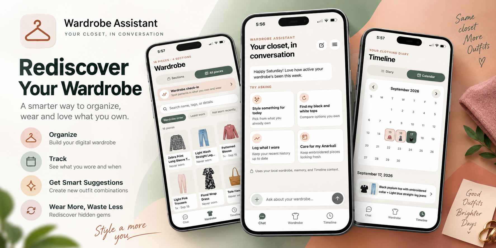

# Wardrobe



Wardrobe is an iOS-first, local-first wardrobe assistant built with Expo and React Native. It keeps your wardrobe, wear history, generated garment images, memory, and chat history on your device. AI requests go through a small Cloudflare Worker so provider keys are never bundled with the app.

## What it does

- Adds garments from photos you explicitly choose in Chat, with duplicate checks and a confirmation step
- Organizes pieces into searchable, reorderable sections
- Answers questions about your wardrobe and suggests outfits, capsules, and packing lists
- Logs outfits to a searchable diary and calendar, including wear counts and notes
- Supports garment editing, archiving, restore, and local JSON backup/restore
- Remembers explicit wardrobe preferences locally and supports light, dark, and system themes

The full shipped scope and current limitations are in [MILESTONE.md](MILESTONE.md).

## Local setup

You need Node.js 22.13 or newer. For iOS, use Expo Go with SDK 57 or Xcode 26.4 or newer.

```bash
npm install
npx expo start --clear
```

Scan the QR code with Expo Go, or press `i` to open the iOS Simulator. The app creates its SQLite database and local memory files on first launch.

Web is also available with `npm run web`, though Expo's SQLite web support is still alpha.

## Cloudflare Worker

The app expects Muse and Gemini calls to go through the Worker in `worker/`. From that directory:

```bash
npm install
npx wrangler login
npx wrangler d1 create wardrobe-ai-integrity
```

Copy the returned D1 database ID into `worker/wrangler.jsonc`, then apply the migration and add the three required secrets:

```bash
npx wrangler d1 migrations apply ATTEST_DB --remote
npx wrangler secret put MUSE_API_KEY
npx wrangler secret put GEMINI_API_KEY
openssl rand -base64 48 | npx wrangler secret put SESSION_SECRET
npm run deploy
```

Create `local-secrets/.env` in the repository root with the deployed Worker URL:

```dotenv
WARDROBE_API_BASE_URL=https://your-worker.workers.dev
```

Restart Expo after changing the URL. See [worker/README.md](worker/README.md) for key rotation and optional Apple App Attest enforcement.

## Checks

```bash
npm run typecheck
npm run lint
npx expo-doctor
npx expo export --platform ios
```
